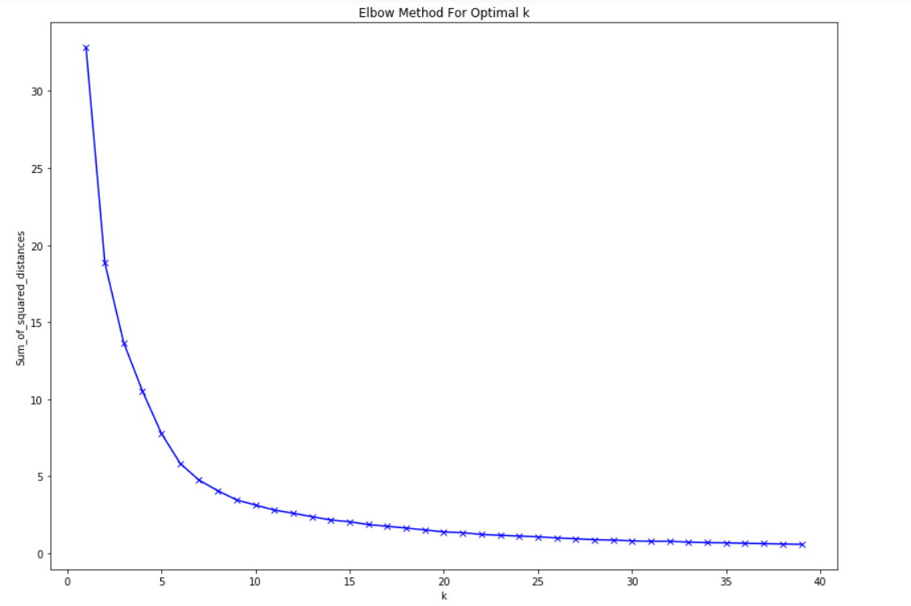

# Commercial_centers_using_POI
Identify commercial centers using Points of Interest (POI) data

There's a lot of open data available about the demographics and geography of the planet. But this information is not necessarily supervised in any particular structure from which insights can be drawn.

This task requires you to create clusters of distinct commercial centers or markets using points of interest data of a city (the city could be yours). Points of interest (POI) data provides location information of different places along with their defining tags like school, type of outlets, type of building, etc.

POI data refers to the coordinates of any physical entity with a tag describing its type like commercial buildings, schools, hospitals, restaurants, etc.

# Data Source:

1) POI (OSM) data- https://www.openstreetmap.org/export#map=14/28.6213/77.2279
You can use overpy (a python frontend for overpass API of OSM) to get OSM data for the desired city.

2) Overpass Turbo : http://overpass-turbo.eu/
### Run the following query for co-ordinates : 28.6123, 77.1847, 28.6490, 77.2548  

    /*
    This has been generated by the overpass-turbo wizard.
    The original search was:
    “boundary=political”
    */

    [out:json][timeout:25];
    // gather results

    (

     // query part for: “boundary=political”
 
    area[name="New Delhi"][boundary=administrative]->.searchArea;
 
    node["amenity"](area.searchArea);
 
          way["amenity"](area.searchArea);
     
          relation["amenity"](area.searchArea);

    );
    // print results
    out body;
    >;
    out skel qt;

# Tools :

1) Python 3
2) Matplotlib
3) Pandas
4) Numpy
5) osmium
6) overpy
7) shapefile
(pip install pyshp)
8) geopandas
9) shapely

# Approach

The overpy api gets the points of interest using only the co-ordinates of the city.

It returns a list with node_id , latitude , longitude , name , amenity etc.
These nodes are converted into dataframe and is stored in the form of CSV file.
Then the furter cleaning of data is done by removing NaN vaues and AMENITIES which are not 
a part of Commercial centers.

The refined data have 495 rows with 6 columns.

### Data Points Plotting

The library used for such purpose is geopandas.
GeoPandas is one of the most satisfying Python packages to use because it produces a tangible, visible output that is directly linked to the real world. Moreover, a lot of the objects we would collect data on (e.g., demographic data, sales metrics, sensor data) have at least one physical element that can help us tie data to a specific location and describe something about the object.

The first step is to download a shape-file(.shp file) of that area in which the geo-spatial data exists. It can be easily found on GOOGLE!!.
Then Simply read in your shape-file with GeoPandas and use matplotlib to plot it like so:
## The map is of DELHI and not of a specific area.

The next step is to get the data in the right format. It is done by turning the regular Pandas DataFrame into a geo-DataFrame, which will require to specify as parameters the original DataFrame, the coordinate reference system (CRS), and the geometry of the new DataFrame. In order to format the geometry appropriately, we will need to convert the longitude and latitude into Points (imported Point from shapely above), reading the training data-set and specify the EPSG:4326.
Now with the latitude and longitude information we can create Points.
GeoPandas will automatically reference the “geometry” column when we plot the data. To do so, we simply layer our data onto the map we plotted above.
## The points are plotted at the given latitude and longitude of an area

All the unique amenities are taken out from the dataframe (here 39) and have been mapped to a numeric value.

### Clustering
   #### 1)KMeans
   #### 2)DBSCAN
   
### 1) KMeans
K-means is a type of unsupervised learning and one of the popular methods of clustering unlabelled data into k clusters. One of the trickier tasks in clustering is identifying the appropriate number of clusters k.The elbow method is used as a way to estimate the value k.
To give equal importance to all features, we need to scale the continuous features. Using scikit-learn’s MinMaxScaler, as the feature matrix is a mix of binary and continuous features.

 In the plot above the elbow is at k=7 indicating the optimal k for this dataset is 7.

The center of the graph contains a huge cluster which indicates a busy area(a market).
But since total unique amenities are 39 we also cluster them accordingly, giving us all the commercial areas.

From the scatterplot, we can observe that most of the points (amenities) are at the center surrounded by far-away points. So, the center area must be the busy main area of the city. Within this large cluster, there may be some small clusters as well.

### 2) DBSCAN

 The main concept of DBSCAN algorithm is to locate regions of high density that are separated from one another by regions of low
 density.
 
 
 
 we use StandardScaler() to standardizes the data and arrange it normal distribution.
 It shows 4 clusters with the center one being the biggest and most compact one indicating a market area.
 the 2nd biggest cluster is on the right.
 
